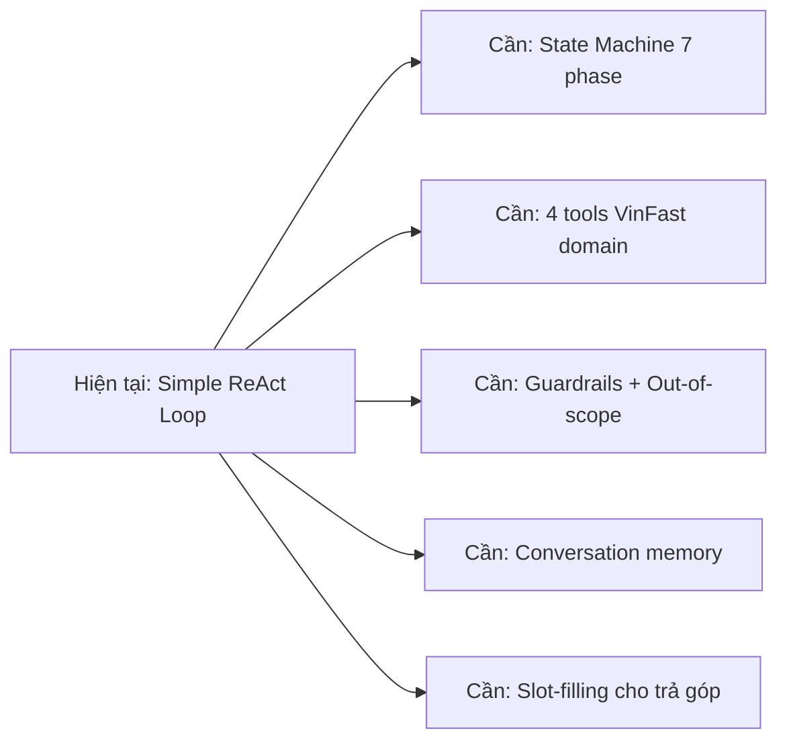
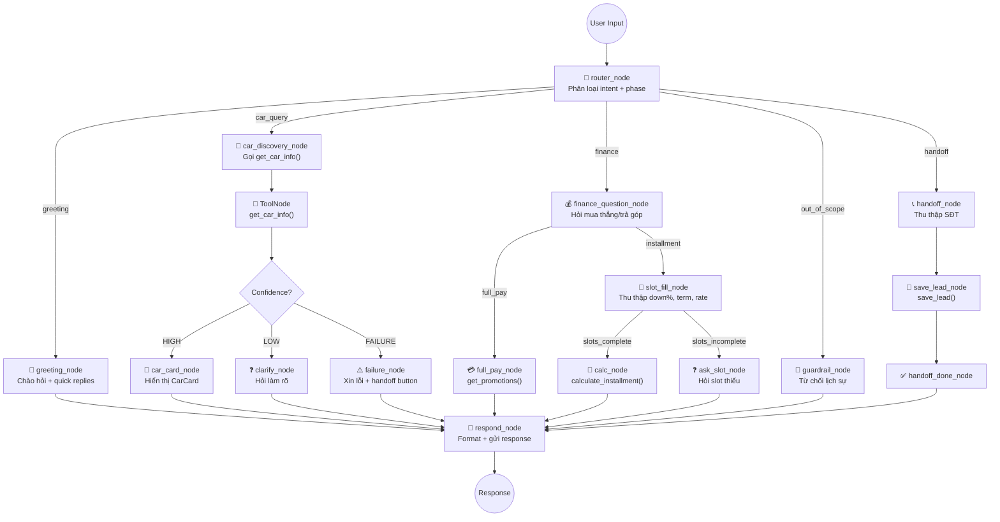

# Kế Hoạch Tái Cấu Trúc: VinFast AI Assistant → LangGraph ReAct Agent

## Bối cảnh & Phân tích hiện trạng

### Hiện trạng hệ thống

Hệ thống hiện tại là một **Inventory Management Agent** (quản lý kho điện thoại) — **chưa phải** VinFast AI Assistant. Cần chuyển đổi toàn bộ domain + kiến trúc.

| Thành phần | Hiện trạng | Vấn đề |
|---|---|---|
| **Agent** | ReAct loop tự viết (`src/agent/agent.py`) — vòng lặp while + regex/JSON parsing | Không có state machine, không quản lý phase, khó mở rộng |
| **Tools** | 3 tools e-commerce (`check_stock`, `get_discount`, `calc_shipping`) | Sai domain — cần thay toàn bộ bằng tools VinFast |
| **Data** | Dict Python hardcode (`data.py`) + SQLite (`vinfast.db`) chưa liên kết | DB đã có `car_variants` (6 dòng xe), `car_prices` (rỗng) |
| **LLM Provider** | Abstract class + OpenAI/Gemini/Local | Tái sử dụng được, cần wrap lại cho LangGraph |
| **UI** | Streamlit side-by-side demo | Cần thay bằng React widget (theo AGENTS.md) hoặc Streamlit mới |
| **Telemetry** | Logger + metrics cơ bản | Giữ và mở rộng theo SPEC (Like/Dislike, handoff rate...) |

### Gap Analysis so với SPEC



---

## User Review Required

> [!IMPORTANT]
> **Quyết định kiến trúc quan trọng**: Kế hoạch này đề xuất sử dụng **LangGraph** làm orchestrator chính thay cho vòng lặp ReAct thủ công hiện tại, và **SQLite làm storage chính** (không dùng Qdrant). Xin hãy review phần phân tích bên dưới trước khi phê duyệt.

> [!WARNING]
> **Breaking change**: Toàn bộ tools hiện tại (`check_stock`, `get_discount`, `calc_shipping`) sẽ bị thay thế. Code e-commerce cũ trong `src/tools/data.py` sẽ bị xóa hoàn toàn.

---

## Phần A: Phân Tích Lựa Chọn Lưu Trữ Dữ Liệu

### So sánh SQLite vs Qdrant cho bài toán VinFast

#### Đặc điểm dữ liệu catalog xe VinFast

| Đặc điểm | Giá trị | Ảnh hưởng đến lựa chọn storage |
|---|---|---|
| Số lượng dòng xe active | ~6-12 (VF3, VF5, VF6, VF7, VF8, VF9 × 1-2 trims) | **Rất nhỏ** — không cần index phức tạp |
| Cấu trúc dữ liệu | Có schema rõ ràng: `car_id`, `price`, `seats`, `range_km`, `battery`... | **Quan hệ mạnh** — relational phù hợp |
| Kiểu truy vấn chính | Filter theo `seats`, `budget_range`, `body_style`, `model_series` | **Exact match + range query** — SQL tối ưu |
| Tần suất cập nhật | Thấp (theo đợt bán hàng VinFast — vài tuần/lần) | Không cần real-time sync |
| Yêu cầu JOIN | Cao: `car_variants` ↔ `car_prices` ↔ `location_tax_fee` ↔ `bank_loan_policy` | **Relational JOIN** là thế mạnh SQL |
| Semantic search | Không thực sự cần — user hỏi "xe 5 chỗ dưới 600 triệu" → filter, không phải similarity | Vector search thừa cho bài toán này |

#### Phân tích chi tiết từng phương án

````carousel
### Phương án 1: SQLite (Relational) — ✅ ĐỀ XUẤT

**Ưu điểm:**
- **Zero infrastructure**: Không cần server riêng, file-based, deploy cùng app
- **ACID compliance**: Đảm bảo tính toàn vẹn dữ liệu giá/tài chính (critical cho SPEC precision ≥95%)
- **JOIN hiệu quả**: `Vehicle_Price` ↔ `Location_Tax_Fee` ↔ `Bank_Loan_Policy` — truy vấn giá lăn bánh chỉ cần 1 SQL query
- **Exact filtering**: `WHERE seats = 5 AND retail_price <= 600000000` — chính xác 100%
- **Schema validation**: Cột `detailed_specs` JSONB cho mở rộng (đã thiết kế trong `guide.md`)
- **Dễ debug + audit**: Dữ liệu tài chính cần trace được nguồn gốc
- **Phù hợp quy mô**: 6-12 dòng xe, không cần scale horizontal

**Nhược điểm:**
- Không hỗ trợ semantic search nếu cần trong tương lai
- Không tối ưu cho unstructured text (nhưng không cần)
<!-- slide -->
### Phương án 2: Qdrant (Vector DB)

**Ưu điểm:**
- Semantic search: "xe gia đình rộng rãi" → tìm qua embedding similarity
- Tốt nếu có tài liệu dài cần RAG (brochure, policy PDF)

**Nhược điểm cho bài toán này:**
- **Overkill**: 6-12 records → embedding + ANN search lãng phí tài nguyên
- **Mất precision**: Similarity search trả về "gần đúng", không đảm bảo `seats = 5` chính xác — **vi phạm yêu cầu precision ≥95%** của SPEC
- **Không hỗ trợ JOIN**: Tính giá lăn bánh cần JOIN 3-4 bảng → phải denormalize dữ liệu, mất tính toàn vẹn
- **Infrastructure phức tạp**: Cần Qdrant server riêng + embedding model
- **Khó audit tài chính**: Vector retrieval là black-box, khó trace "tại sao AI chọn số này"
- **Cost tăng**: Embedding mỗi query + Qdrant hosting vs SQLite miễn phí
<!-- slide -->
### Phương án 3: Hybrid (SQLite + Qdrant) — Có thể xem xét tương lai

**Khi nào cần:**
- Khi bổ sung RAG cho tài liệu chính sách dài (PDF brochure, FAQ)
- Khi catalog mở rộng tới hàng trăm sản phẩm (phụ kiện, dịch vụ)
- Khi cần semantic understanding cho câu hỏi phức tạp

**Kết luận hiện tại:** Chưa cần. Data flywheel chưa kick in.
````

#### Kết luận phân tích Storage

> [!TIP]
> **Đề xuất: Sử dụng SQLite là lựa chọn tối ưu** cho giai đoạn hiện tại, vì:
> 1. Dữ liệu có cấu trúc quan hệ rõ ràng (4 bảng theo `guide.md`)
> 2. Số lượng records rất nhỏ (~6-12 xe) → không cần ANN/vector index
> 3. Yêu cầu **precision ≥95%** (SPEC) đòi hỏi exact match, không phải fuzzy retrieval
> 4. Tính toán tài chính cần **JOIN + arithmetic chính xác** — SQL sinh ra cho việc này
> 5. Zero infrastructure cost — phù hợp hackathon/prototype

---

## Phần B: Kiến Trúc LangGraph ReAct Agent

### Tại sao chuyển từ ReAct thủ công sang LangGraph?

| Tiêu chí | ReAct thủ công hiện tại | LangGraph |
|---|---|---|
| State management | Không có — chỉ có `current_prompt` string concat | `TypedDict` state machine native |
| Phase transitions | Không có | `StateGraph` + conditional edges |
| Conversation memory | Không persist | `MemorySaver` / `SqliteSaver` checkpointer |
| Tool execution | Regex parsing → manual dispatch | `ToolNode` + `tool_calls` native |
| Error recovery | `max_steps_exceeded` | `RetryPolicy`, branching, human-in-the-loop |
| Multi-step reasoning | While loop với string prompt | Graph nodes + edges — visualizable |
| Slot-filling | Không có | Custom node với state update |

### Kiến trúc tổng thể đề xuất



### State Schema (LangGraph TypedDict)

```python
from typing import TypedDict, Literal, Optional, List, Annotated
from langgraph.graph.message import add_messages

class VinFastState(TypedDict):
    # Conversation
    messages: Annotated[list, add_messages]
    
    # Phase tracking
    current_phase: Literal[
        "GREETING", "CAR_DISCOVERY", "FINANCE_QUESTION",
        "FINANCE_FULL_PAY", "FINANCE_INSTALLMENT",
        "HANDOFF_COLLECT", "HANDOFF_DONE"
    ]
    
    # Car selection
    selected_car_id: Optional[str]
    selected_car_info: Optional[dict]
    
    # Finance slot-filling
    finance_slots: dict  # {down_payment, loan_term_months, interest_rate}
    
    # Confidence tracking
    confidence: Literal["HIGH", "LOW", "FAILURE"]
    
    # Lead info
    customer_name: Optional[str]
    customer_phone: Optional[str]
    
    # Telemetry
    session_id: str
    feedback_log: List[dict]
```

---

## Proposed Changes

### Component 1: Database Layer (Hoàn thiện SQLite)

Sử dụng schema đã thiết kế trong `guide.md`, bổ sung dữ liệu còn thiếu.

#### [MODIFY] [vinfast.db](file:///d:/tai_lieu_hoc_AI/AI20K_VINUNI/assignments/VINFAST_AI_assistant/data/vinfast.db)
- Populate bảng `car_prices` (hiện đang rỗng)
- Tạo mới bảng `location_tax_fee` (phí theo khu vực)
- Tạo mới bảng `bank_loan_policy` (chính sách vay)
- Bổ sung dữ liệu `seats`, `range_wltp_km` cho `car_variants` (hiện thiếu)

#### [NEW] [db_init.py](file:///d:/tai_lieu_hoc_AI/AI20K_VINUNI/assignments/VINFAST_AI_assistant/data/db_init.py)
- Script khởi tạo schema + seed data
- Đảm bảo reproducible database state

#### [NEW] [db_queries.py](file:///d:/tai_lieu_hoc_AI/AI20K_VINUNI/assignments/VINFAST_AI_assistant/src/core/db_queries.py)
- Data access layer: các hàm query SQLite thuần
- `get_car_by_filters()`, `get_car_price()`, `get_location_fees()`, `get_bank_policies()`

---

### Component 2: VinFast Tools (Thay thế e-commerce tools)

#### [DELETE] [data.py](file:///d:/tai_lieu_hoc_AI/AI20K_VINUNI/assignments/VINFAST_AI_assistant/src/tools/data.py)
#### [DELETE] [inventory.py](file:///d:/tai_lieu_hoc_AI/AI20K_VINUNI/assignments/VINFAST_AI_assistant/src/tools/inventory.py)
#### [DELETE] [coupons.py](file:///d:/tai_lieu_hoc_AI/AI20K_VINUNI/assignments/VINFAST_AI_assistant/src/tools/coupons.py)
#### [DELETE] [shipping.py](file:///d:/tai_lieu_hoc_AI/AI20K_VINUNI/assignments/VINFAST_AI_assistant/src/tools/shipping.py)

#### [NEW] [car_info.py](file:///d:/tai_lieu_hoc_AI/AI20K_VINUNI/assignments/VINFAST_AI_assistant/src/tools/car_info.py)
```python
# Tool: get_car_info(query, filters) → CarInfo[]
# Query SQLite: car_variants JOIN car_prices
# Trả về: model, trim, price, specs, ảnh
```

#### [NEW] [promotions.py](file:///d:/tai_lieu_hoc_AI/AI20K_VINUNI/assignments/VINFAST_AI_assistant/src/tools/promotions.py)
```python
# Tool: get_promotions(model, region) → PriceDetail
# Query: car_prices JOIN location_tax_fee
# Trả về: base_price, fees, total_on_road, promos
```

#### [NEW] [installment.py](file:///d:/tai_lieu_hoc_AI/AI20K_VINUNI/assignments/VINFAST_AI_assistant/src/tools/installment.py)
```python
# Tool: calculate_installment(car_price, down_payment_ratio, loan_term_months, annual_interest_rate)
# Tính toán thuần Python: gốc + lãi giảm dần
# Trả về: monthly_payment, total_payment, total_interest, schedule
```

#### [NEW] [lead.py](file:///d:/tai_lieu_hoc_AI/AI20K_VINUNI/assignments/VINFAST_AI_assistant/src/tools/lead.py)
```python
# Tool: save_lead(name, phone, conversation_context, selected_car, finance_summary)
# Lưu vào SQLite bảng leads + trigger notification mock
```

#### [MODIFY] [registry.py](file:///d:/tai_lieu_hoc_AI/AI20K_VINUNI/assignments/VINFAST_AI_assistant/src/tools/registry.py)
- Đăng ký 4 tools mới thay cho 3 tools cũ
- Format theo LangGraph `@tool` decorator

#### [MODIFY] [__init__.py](file:///d:/tai_lieu_hoc_AI/AI20K_VINUNI/assignments/VINFAST_AI_assistant/src/tools/__init__.py)
- Export tools mới

---

### Component 3: LangGraph Agent (Thay thế ReAct loop)

#### [MODIFY] [agent.py](file:///d:/tai_lieu_hoc_AI/AI20K_VINUNI/assignments/VINFAST_AI_assistant/src/agent/agent.py)
- Xóa class `ReActAgent` cũ (while loop + regex)
- Thay bằng `build_vinfast_graph()` sử dụng `StateGraph`
- Implement các nodes: `router_node`, `greeting_node`, `car_discovery_node`, `finance_node`, `slot_fill_node`, `handoff_node`, `guardrail_node`
- Conditional edges cho phase transitions
- `MemorySaver` checkpointer cho conversation memory

#### [MODIFY] [chatbot.py](file:///d:/tai_lieu_hoc_AI/AI20K_VINUNI/assignments/VINFAST_AI_assistant/src/agent/chatbot.py)
- Cập nhật `SimpleChatbot` system prompt sang domain VinFast
- Dùng làm baseline so sánh

#### [MODIFY] [parsing.py](file:///d:/tai_lieu_hoc_AI/AI20K_VINUNI/assignments/VINFAST_AI_assistant/src/agent/parsing.py)
- Xóa e-commerce schemas (`CheckStockArgs`, `GetDiscountArgs`, `CalcShippingArgs`)
- Thêm VinFast schemas: `CarQueryArgs`, `InstallmentArgs`, `LeadArgs`
- Hoặc loại bỏ hoàn toàn nếu dùng LangGraph native tool calling

#### [NEW] [prompts.py](file:///d:/tai_lieu_hoc_AI/AI20K_VINUNI/assignments/VINFAST_AI_assistant/src/agent/prompts.py)
- System prompt cho Vivi AI (domain VinFast)
- Prompt templates cho từng phase
- Guardrail instructions (out-of-scope, prompt injection)

#### [NEW] [state.py](file:///d:/tai_lieu_hoc_AI/AI20K_VINUNI/assignments/VINFAST_AI_assistant/src/agent/state.py)
- `VinFastState` TypedDict
- State initialization functions
- Phase transition logic

#### [NEW] [nodes.py](file:///d:/tai_lieu_hoc_AI/AI20K_VINUNI/assignments/VINFAST_AI_assistant/src/agent/nodes.py)
- Tất cả graph nodes tách riêng cho clean code
- `router_node()`, `car_discovery_node()`, `finance_node()`, etc.

---

### Component 4: LLM Provider (Adapter cho LangGraph)

#### [NEW] [langchain_adapter.py](file:///d:/tai_lieu_hoc_AI/AI20K_VINUNI/assignments/VINFAST_AI_assistant/src/core/langchain_adapter.py)
- Wrap `ChatOpenAI` / `ChatGoogleGenerativeAI` cho LangGraph
- Hoặc adapter để giữ tương thích với `LLMProvider` hiện tại

---

### Component 5: Application Entry Point

#### [MODIFY] [app.py](file:///d:/tai_lieu_hoc_AI/AI20K_VINUNI/assignments/VINFAST_AI_assistant/app.py)
- Thay "Inventory Management Agent" → "VinFast AI Assistant — Vivi AI"
- Cập nhật UI layout cho domain tư vấn xe
- Tích hợp LangGraph agent thay cho ReAct cũ
- Thêm conversation history display

#### [MODIFY] [requirements.txt](file:///d:/tai_lieu_hoc_AI/AI20K_VINUNI/assignments/VINFAST_AI_assistant/requirements.txt)
```diff
+langgraph>=0.2.0
+langchain>=0.3.0
+langchain-openai>=0.2.0
+langchain-google-genai>=2.0.0
 openai>=1.0.0
 google-generativeai>=0.5.0
 python-dotenv>=1.0.0
 pydantic>=2.0.0
 requests>=2.31.0
 pytest>=7.4.0
-llama-cpp-python>=0.2.0
 streamlit
```

---

### Component 6: Telemetry (Mở rộng)

#### [MODIFY] [metrics.py](file:///d:/tai_lieu_hoc_AI/AI20K_VINUNI/assignments/VINFAST_AI_assistant/src/telemetry/metrics.py)
- Thêm tracking: `handoff_rate`, `session_length`, `re_ask_rate`, `slot_correction_rate`
- Thêm `track_feedback(session_id, message_id, feedback_type)`

#### [MODIFY] [logger.py](file:///d:/tai_lieu_hoc_AI/AI20K_VINUNI/assignments/VINFAST_AI_assistant/src/telemetry/logger.py)
- Thêm event types: `OUT_OF_SCOPE`, `PHASE_TRANSITION`, `SLOT_FILL`, `LEAD_SAVED`

---

## Cấu trúc thư mục sau refactor

```
VINFAST_AI_assistant/
├── app.py                          # Streamlit entry point (VinFast domain)
├── requirements.txt                # + langgraph, langchain
├── data/
│   ├── vinfast.db                  # SQLite: 6 bảng (hoàn thiện)
│   └── db_init.py                  # Schema + seed data script
├── src/
│   ├── agent/
│   │   ├── agent.py                # LangGraph StateGraph builder
│   │   ├── state.py                # [NEW] VinFastState TypedDict
│   │   ├── nodes.py                # [NEW] Graph nodes
│   │   ├── prompts.py              # [NEW] System prompts per phase
│   │   ├── chatbot.py              # Baseline chatbot (VinFast domain)
│   │   └── parsing.py              # [SIMPLIFIED] VinFast schemas
│   ├── core/
│   │   ├── llm_provider.py         # Abstract base (giữ nguyên)
│   │   ├── openai_provider.py      # OpenAI impl (giữ nguyên)
│   │   ├── gemini_provider.py      # Gemini impl (giữ nguyên)
│   │   ├── langchain_adapter.py    # [NEW] LangGraph LLM wrapper
│   │   └── db_queries.py           # [NEW] SQLite data access layer
│   ├── tools/
│   │   ├── __init__.py             # Export 4 VinFast tools
│   │   ├── registry.py             # Tool registry (LangGraph format)
│   │   ├── car_info.py             # [NEW] get_car_info()
│   │   ├── promotions.py           # [NEW] get_promotions()
│   │   ├── installment.py          # [NEW] calculate_installment()
│   │   └── lead.py                 # [NEW] save_lead()
│   ├── telemetry/
│   │   ├── logger.py               # Extended event types
│   │   └── metrics.py              # Extended metrics
│   └── documents/
│       └── API_DEFINE.md           # API documentation
├── SPEC/                           # Giữ nguyên
├── AGENTS.md                       # Giữ nguyên
└── guide.md                        # Giữ nguyên
```

---

## Lộ Trình Triển Khai (4 Phases)

### Phase 1: Database + Tools (Ưu tiên cao nhất)
1. Hoàn thiện SQLite schema (tạo `db_init.py`, populate data)
2. Viết `db_queries.py` — data access layer
3. Implement 4 VinFast tools + unit tests
4. Xóa e-commerce tools cũ

### Phase 2: LangGraph Agent Core
1. Cài đặt `langgraph`, `langchain`
2. Tạo `VinFastState` + `nodes.py`
3. Build `StateGraph` với router + phase transitions
4. Tích hợp tools vào `ToolNode`
5. Test vòng lặp cơ bản: GREETING → CAR_DISCOVERY → FINANCE

### Phase 3: Slot-filling + Guardrails
1. Implement slot-fill logic cho FINANCE_INSTALLMENT
2. Guardrail node cho out-of-scope detection
3. Confidence evaluation logic
4. Conversation memory với `MemorySaver`

### Phase 4: App Integration + Telemetry
1. Cập nhật `app.py` sang VinFast domain
2. Mở rộng telemetry (feedback, handoff tracking)
3. Baseline chatbot comparison
4. End-to-end testing

---

## Open Questions

> [!IMPORTANT]
> **Q1: Frontend stack?** AGENTS.md mô tả React components (`<ChatWidget>`, `<CarCard>`...). Hiện tại app dùng Streamlit. Bạn muốn:
> - **Option A**: Giữ Streamlit cho prototype backend, để team UI (Ngọc) làm React riêng?
> - **Option B**: Build cả frontend React trong project này?

> [!IMPORTANT]
> **Q2: LLM Provider chính?** LangGraph tích hợp tốt nhất với `langchain-openai` (ChatOpenAI) hoặc `langchain-google-genai`. Bạn muốn dùng provider nào làm mặc định? Hiện env có cả OpenAI key và Gemini key.

> [!WARNING]
> **Q3: Dữ liệu xe thiếu khá nhiều.** Database hiện chỉ có 6 dòng xe, thiếu `seats`, `range_wltp_km`, và bảng `car_prices` trống hoàn toàn. Team Nam (crawl data) đã crawl xong chưa? Hay cần hardcode data tạm?

> [!IMPORTANT]
> **Q4: Local LLM (llama-cpp)?** Hiện requirements có `llama-cpp-python`. LangGraph không hỗ trợ native. Có cần giữ local LLM provider không, hay bỏ để giảm complexity?

---

## Verification Plan

### Automated Tests

```bash
# Unit tests cho từng tool
pytest tests/test_car_info.py -v
pytest tests/test_installment.py -v
pytest tests/test_promotions.py -v

# Integration test cho LangGraph flow
pytest tests/test_agent_flow.py -v

# Test slot-filling logic
pytest tests/test_slot_fill.py -v
```

### Manual Verification
- Chạy `streamlit run app.py` → test các scenario trong SPEC:
  - Happy path: Hỏi VF5 → chọn xe → tính trả góp → để lại SĐT
  - Low-confidence: "xe điện rẻ?" → AI hỏi lại
  - Out-of-scope: "So sánh VinFast với Tesla" → từ chối lịch sự
  - Failure: Nhập số liệu bất thường → handoff button
- Kiểm tra database queries trả đúng data
- Verify disclaimer xuất hiện ở mọi bảng tính tài chính
